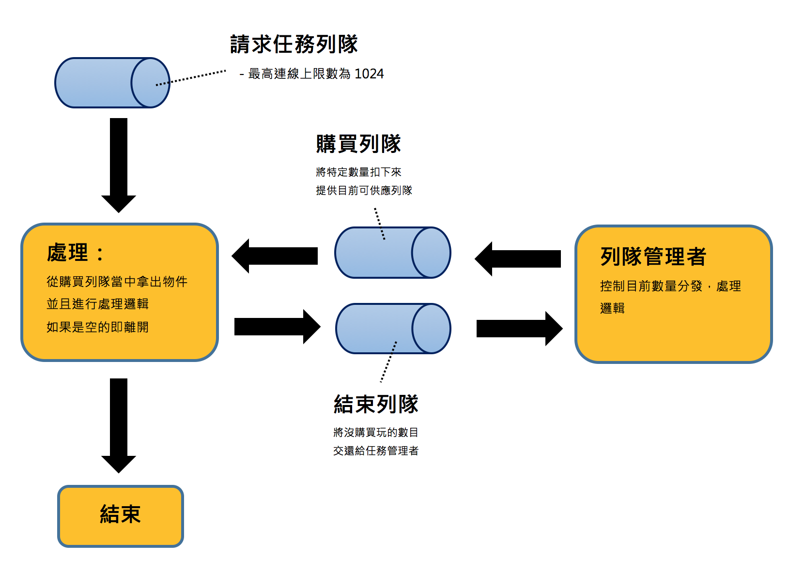

# snap-up
這是一個模擬搶票需求的伺服器端 sample。
目前忽略了一些資源初始化以及購買結束後資源釋放的問題，但是只要增加這部分的邏輯，運用在實際專案上也沒有問題。

## description



執行之後進行以下步驟：
```
- 初始化「任務管理者 Looper」/ 「任務 channel」 和 「結果 channel」
- 管理者得到目前資料庫裡的產品數量後，將其切割為「一次最大購買量」的等份，放置進「任務channel」當中，當外部購買請求進入的時候，如果從「任務 channel」當中得到的數字不為 0，即進行購買商品的動作，並且在購買完畢之後將少於「最大購買量」的數字推進「結果 channel」當中。
- 管理者將前一次沒有購買完的數量與目前數量整合之後，重新將數目推入「任務 channel」，以此循環。
```

壓力測試部分使用 [hulk](https://github.com/grafov/hulk)

目前設定總共有兩張表
第一張表 products 表紀錄「一次最多可以購買的數量」，「目前產品數量」，「開放購買的時間」

products Table

| Field        |  Type       |   Null       |   Key        |   Default  |      Extra  |
| ------------- | ------------- | ------------- | ------------- | ------------- | ------------- |
| id             | int(11)   | NO   | PRI | NULL    | auto_increment |
| max_buy        | int(11)   | NO   | .    | NULL    | .               |
| item_number    | int(11)   | NO   | .    | NULL    |  .              |
| available_time | timestamp | YES  | .    | NULL    |   .             |

records 表紀錄「產品id」，「客戶id」，「購買數量」，「購買時間」

records Table

| Field        |  Type       |   Null       |   Key        |   Default  |      Extra  |
| ------------- | ------------- | ------------- | ------------- | ------------- | ------------- |
| id          | int(11)   | NO   | PRI | NULL    | auto_increment |
| product_id  | int(11)   | YES  | .    | NULL    | .               |
| customer_id | int(11)   | YES  | .    | NULL    | .               |
| number      | int(11)   | YES  | .    | NULL    | .               |
| date        | timestamp | YES  | .    | NULL    | .               |
